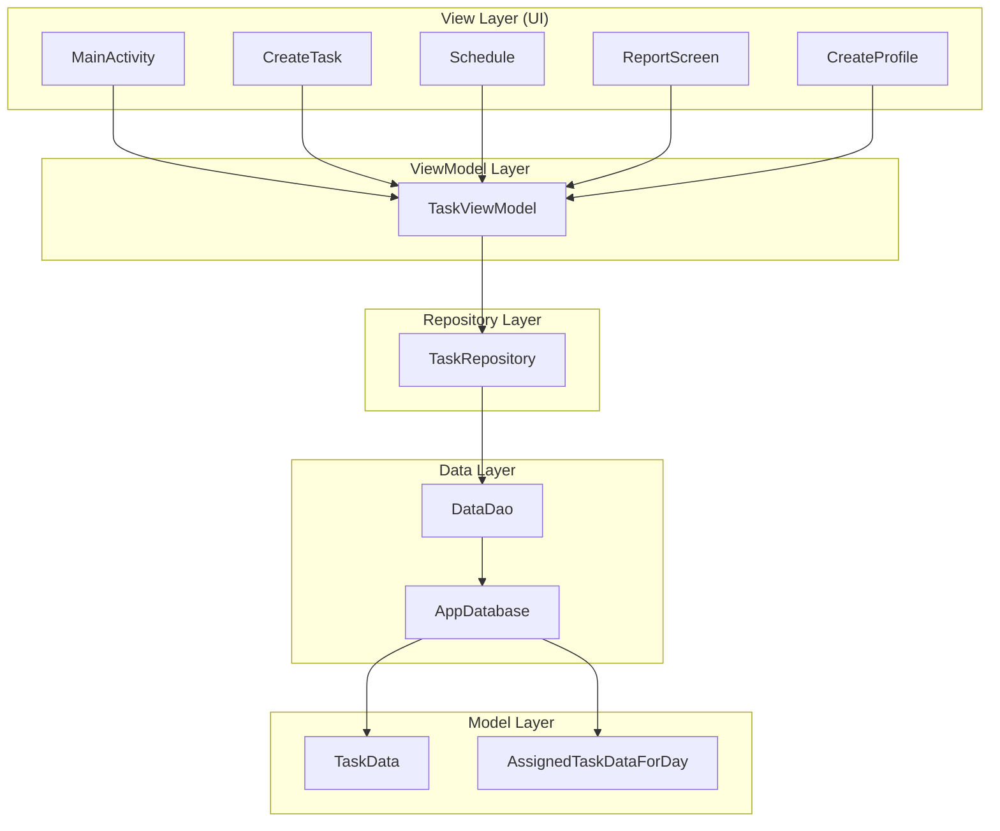

# Dynamic Work Scheduler
**Dynamic Work Scheduler** is a robust Android application developed in Kotlin, designed to streamline personal task management. It offers a sophisticated scheduling system that allows users to plan their work week, visualize time allocation, and track productivity through intuitive analytics.
## Key Features
-   ** Smart Multi-Day Scheduling**
    -   Plan tasks up to **6 days in advance**.
    -   Visual timeline view to see your day at a glance.
    -   Automatic time "chunking" for better organization.
-   ** Advanced Task Management**
    -   Create detailed tasks with start times and durations.
    -   **Duplicate Prevention**: Intelligent logic prevents scheduling conflicting or duplicate tasks.
    -   Persistent storage of all task data.
-   ** Analytics & Reporting**
    -   **Weekly Reports**: Get insights into your productivity trends.
    -   **Visualizations**: Interactive pie charts powered by MPAndroidChart show exactly where your time goes.
-   ** User Personalization**
    -   Customizable user profiles.
    -   Data persistence across sessions.
##  Architecture
The application is built on the **MVVM (Model-View-ViewModel)** architecture, ensuring a clean separation of concerns, scalability, and testability.

### Components Breakdown
-   **View Layer**: Activities (`MainActivity`, `CreateTask`, etc.) observe the ViewModel and update the UI. They handle user input but contain no business logic.
-   **ViewModel Layer**: `TaskViewModel` holds the UI state and communicates with the Repository. It survives configuration changes (like screen rotation).
-   **Repository Layer**: `TaskRepository` acts as the single source of truth, abstracting the data sources from the rest of the app.
-   **Data Layer**: Built with **Room**, consisting of Entities (`TaskData`), DAOs (`DataDao`), and the Database definition (`AppDatabase`).
##  Tech Stack
-   **Language**: [Kotlin](https://kotlinlang.org/) (100%)
-   **Android Jetpack**:
    -   **ViewModel & LiveData**: For reactive UI updates.
    -   **Room**: For robust local SQLite database handling.
    -   **Navigation**: For seamless screen transitions.
-   **Visualization**: [MPAndroidChart](https://github.com/PhilJay/MPAndroidChart) for rendering complex graphs.
-   **Backend Services**: Firebase (integrated via `google-services.json`).
-   **Build Tool**: Gradle.
##  Getting Started
### Prerequisites
-   Android Studio Iguana (2023.2.1) or newer.
-   Java Development Kit (JDK) 17.
### Installation & Setup
1.  **Clone the Repository**
    ```bash
    git clone https://github.com/sivakanth1/Dynamic-Work-Scheduler1.git
    cd Dynamic-Work-Scheduler1
    ```
2.  **Open in Android Studio**
    -   Launch Android Studio.
    -   Select **File > Open** and choose the project directory.
3.  **Firebase Configuration**
    -   The project relies on Firebase. Ensure `app/google-services.json` is present.
    -   If you plan to use your own Firebase project, replace this file with your own configuration from the Firebase Console.
4.  **Build and Run**
    -   Let Gradle sync dependencies.
    -   Select your target device (Emulator or Physical).
    -   Click **Run 'app'**.
##  Project Structure
```
app/src/main/java/com/example/dynamicworkscheduler/
├── data/                       # Data Layer (Room, Repository, Models)
│   ├── AppDatabase.kt          # Database definition
│   ├── DataDao.kt              # Database access methods
│   ├── TaskRepository.kt       # Data mediator
│   ├── TaskViewModel.kt        # UI State holder
│   └── ...
├── CreateProfile.kt            # Profile creation logic
├── CreateTask.kt               # Task entry interface
├── MainActivity.kt             # App entry & navigation
├── ReportScreen.kt             # Analytics visualization
├── Schedule.kt                 # Timeline view logic
└── ...
```
##  Contributing
Contributions are what make the open-source community such an amazing place to learn, inspire, and create. Any contributions you make are **greatly appreciated**.
1.  Fork the Project
2.  Create your Feature Branch (`git checkout -b feature/AmazingFeature`)
3.  Commit your Changes (`git commit -m 'Add some AmazingFeature'`)
4.  Push to the Branch (`git push origin feature/AmazingFeature`)
5.  Open a Pull Request
##  License
Distributed under the MIT License. See `LICENSE` for more information.
